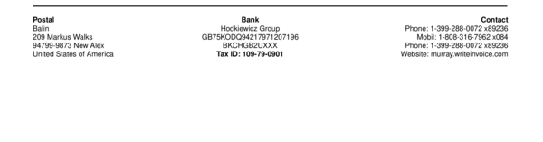
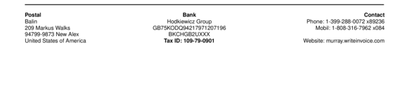

# footer__right__three

Set a reference for `"right"` "footer" section to a formatted string.


## Preview

<div >
    <canvas id='canvas' search=':footer__right__three' palette='option_detail'></canvas>
</div>
<script src="../assets/js/marker.js"></script>  

 
## Default

### Hash

```ruby
{
 :footer__right__three => :sections__nine__right_three__content
} 
```

### Key

| **Name** | **Category** | **Section** |
| :--- | :--- | :--- |
| ```:footer__right__three``` |  [Footer](./#footer) | [Footer](/sections/footer) |

### Value

Allow only Type Symbol

| **Default**| **Validation**| **Type** |
| :--- | :--- | :--- |
| ```:sections__nine__right_three__content``` | ```:^[a-zA-Z0-9_]*$``` | Symbol |

## Example A.

Change pointer to: `:sections__nine__right_one__content`.

### Output




### Parameters

| | **Value** | **Type** |
|------:|:------|:------|
| **Output** | 'my-invoice.pdf' | String |
| **Payload** | {...} [see Payload](../payload) | hash |
| **Options** | ```{:footer__right__three => :sections__nine__right_one__content}``` | hash |


### Source Code

* Invoke Function

```ruby
require 'write_invoice'
 
pyld = WriteInvoice::Example.generate()
opts = {
 :footer__right__three => :sections__nine__right_one__content
}
 
WriteInvoice::Document.generate( output: 'my-invoice.pdf', payload: pyld, options: opts )

```

## Example B.

Change Text to: `""`.

### Output




### Parameters

| | **Value** | **Type** |
|------:|:------|:------|
| **Output** | 'my-invoice.pdf' | String |
| **Payload** | {...} [see Payload](../payload) | hash |
| **Options** | ```{:sections__nine__right_three => {:content => nil, :struct => "", :assigns => []}, :footer__right__three => :sections__nine__right_three__content}``` | hash |


### Source Code

* Invoke Function

```ruby
require 'write_invoice'
 
pyld = WriteInvoice::Example.generate()
opts = {
 :sections__nine__right_three => {:content => nil, :struct => "", :assigns => []},
 :footer__right__three => :sections__nine__right_three__content
}
 
WriteInvoice::Document.generate( output: 'my-invoice.pdf', payload: pyld, options: opts )

```

