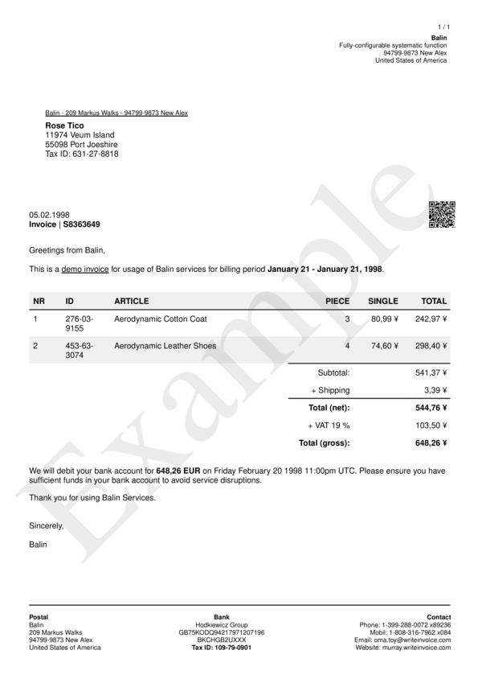
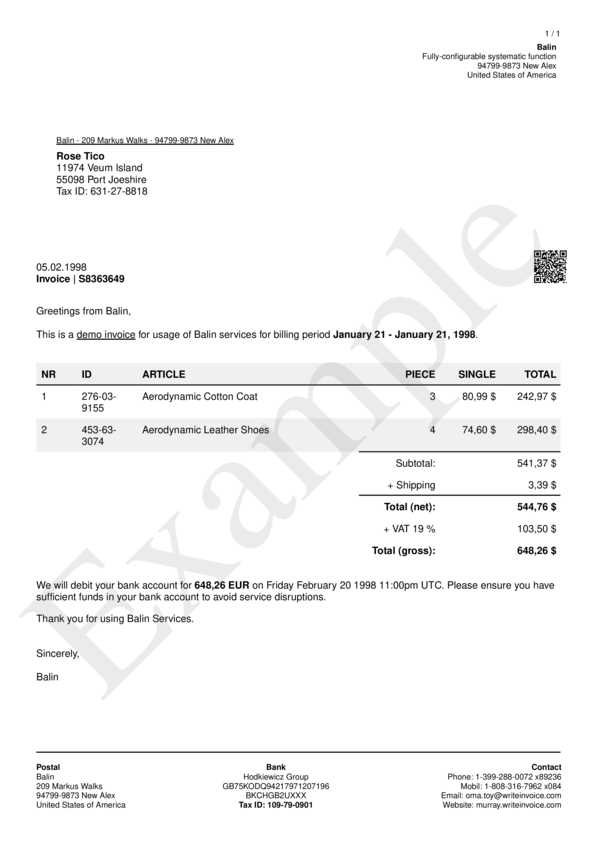

# format_types__currency__short

Define Format Type for viewing currency values in a `short form`.


## Preview

<div >
    <canvas id='canvas' search=':format_types__currency__short' palette='option_detail'></canvas>
</div>
<script src="../assets/js/marker.js"></script>  

 
## Default

### Hash

```ruby
{
 :format_types__currency__short => 
  {:delimiter => ".",
   :separator => ",",
   :precision => 2,
   :unit => "",
   :format => "%n €"}
} 
```

### Key

| **Name** | **Category** | **Section** |
| :--- | :--- | :--- |
| ```:format_types__currency__short``` |  [Format Types](./#format_types) | [All](../sections/) |

### Value


| **Default**| **Validation**| **Type** |
| :--- | :--- | :--- |
| ```{:delimiter=>".", :separator=>",", :precision=>2, :unit=>"", :format=>"%n €"}``` | ```^{a-zA-Z0-9}*$``` | Hash |

## Example A.

Change currency symbol to `"¥"`.

### Output




### Parameters

| | **Value** | **Type** |
|------:|:------|:------|
| **Output** | 'my-invoice.pdf' | String |
| **Payload** | {...} [see Payload](../payload) | hash |
| **Options** | ```{:format_types__currency__short =>   {:delimiter => ".",   :separator => ",",   :precision => 2,   :unit => "",   :format => "%n ¥"}}``` | hash |


### Source Code

* Invoke Function

```ruby
require 'write_invoice'
 
pyld = WriteInvoice::Example.generate()
opts = {
 :format_types__currency__short => 
  {:delimiter => ".",
   :separator => ",",
   :precision => 2,
   :unit => "",
   :format => "%n ¥"}
}
 
WriteInvoice::Document.generate( output: 'my-invoice.pdf', payload: pyld, options: opts )

```

## Example B.

Change currency symbol to `"$"`.

### Output




### Parameters

| | **Value** | **Type** |
|------:|:------|:------|
| **Output** | 'my-invoice.pdf' | String |
| **Payload** | {...} [see Payload](../payload) | hash |
| **Options** | ```{:format_types__currency__short =>   {:delimiter => ".",   :separator => ",",   :precision => 2,   :unit => "",   :format => "%n $"}}``` | hash |


### Source Code

* Invoke Function

```ruby
require 'write_invoice'
 
pyld = WriteInvoice::Example.generate()
opts = {
 :format_types__currency__short => 
  {:delimiter => ".",
   :separator => ",",
   :precision => 2,
   :unit => "",
   :format => "%n $"}
}
 
WriteInvoice::Document.generate( output: 'my-invoice.pdf', payload: pyld, options: opts )

```

