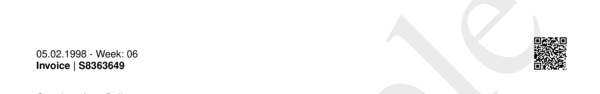

# format_types__date__eu

Define Format Type for viewing date values for the `EU region`.


## Preview

<div >
    <canvas id='canvas' search=':format_types__date__eu' palette='option_detail'></canvas>
</div>
<script src="../assets/js/marker.js"></script>  

 
## Default

### Hash

```ruby
{
 :format_types__date__eu => {:strf => "%d.%m.%Y"}
} 
```

### Key

| **Name** | **Category** | **Section** |
| :--- | :--- | :--- |
| ```:format_types__date__eu``` |  [Format Types](./#format_types) | [Three](/sections/three) |

### Value


| **Default**| **Validation**| **Type** |
| :--- | :--- | :--- |
| ```{:strf=>"%d.%m.%Y"}``` | ```^{a-zA-Z0-9}*$``` | Hash |

## Example A.

Display date in `US Style`.

### Output


### Parameters

| | **Value** | **Type** |
|------:|:------|:------|
| **Output** | 'my-invoice.pdf' | String |
| **Payload** | {...} [see Payload](../payload) | hash |
| **Options** | ```{:format_types__date__eu => {:strf => "%m/%d/%Y"}}``` | hash |


### Source Code

* Invoke Function

```ruby
require 'write_invoice'
 
pyld = WriteInvoice::Example.generate()
opts = {
 :format_types__date__eu => {:strf => "%m/%d/%Y"}
}
 
WriteInvoice::Document.generate( output: 'my-invoice.pdf', payload: pyld, options: opts )

```

## Example B.

Display date with `Weeknumber`.

### Output




### Parameters

| | **Value** | **Type** |
|------:|:------|:------|
| **Output** | 'my-invoice.pdf' | String |
| **Payload** | {...} [see Payload](../payload) | hash |
| **Options** | ```{:format_types__date__eu => {:strf => "%d.%m.%Y - Week: %V"}}``` | hash |


### Source Code

* Invoke Function

```ruby
require 'write_invoice'
 
pyld = WriteInvoice::Example.generate()
opts = {
 :format_types__date__eu => {:strf => "%d.%m.%Y - Week: %V"}
}
 
WriteInvoice::Document.generate( output: 'my-invoice.pdf', payload: pyld, options: opts )

```

