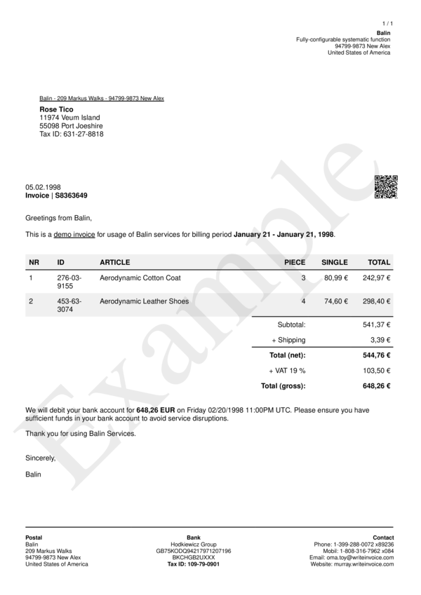

# format_types__date__long

Define Format Type for viewing date values in a `long form`.


## Preview

<div >
    <canvas id='canvas' search=':format_types__date__long' palette='option_detail'></canvas>
</div>
<script src="../assets/js/marker.js"></script>  

 
## Default

### Hash

```ruby
{
 :format_types__date__long => {:strf => "%A %B %d %Y %I:%M%P UTC"}
} 
```

### Key

| **Name** | **Category** | **Section** |
| :--- | :--- | :--- |
| ```:format_types__date__long``` |  [Format Types](./#format_types) | [All](../sections/) |

### Value


| **Default**| **Validation**| **Type** |
| :--- | :--- | :--- |
| ```{:strf=>"%A %B %d %Y %I:%M%P UTC"}``` | ```^{a-zA-Z0-9}*$``` | Hash |

## Example A.

Display date in `EU Style`.

### Output


### Parameters

| | **Value** | **Type** |
|------:|:------|:------|
| **Output** | 'my-invoice.pdf' | String |
| **Payload** | {...} [see Payload](../payload) | hash |
| **Options** | ```{:format_types__date__long => {:strf => "%A %d.%B.%Y %H:%M UTC"}}``` | hash |


### Source Code

* Invoke Function

```ruby
require 'write_invoice'
 
pyld = WriteInvoice::Example.generate()
opts = {
 :format_types__date__long => {:strf => "%A %d.%B.%Y %H:%M UTC"}
}
 
WriteInvoice::Document.generate( output: 'my-invoice.pdf', payload: pyld, options: opts )

```

## Example B.

Display date is `US Style`.

### Output




### Parameters

| | **Value** | **Type** |
|------:|:------|:------|
| **Output** | 'my-invoice.pdf' | String |
| **Payload** | {...} [see Payload](../payload) | hash |
| **Options** | ```{:format_types__date__long => {:strf => "%A %m/%d/%Y %I:%M%p UTC"}}``` | hash |


### Source Code

* Invoke Function

```ruby
require 'write_invoice'
 
pyld = WriteInvoice::Example.generate()
opts = {
 :format_types__date__long => {:strf => "%A %m/%d/%Y %I:%M%p UTC"}
}
 
WriteInvoice::Document.generate( output: 'my-invoice.pdf', payload: pyld, options: opts )

```

