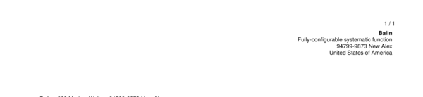

# headline__default__border_width

Set `border width` in section "one" (headline).


## Preview

<div >
    <canvas id='canvas' search=':headline__default__border_width' palette='option_detail'></canvas>
</div>
<script src="../assets/js/marker.js"></script>  

 
## Default

### Hash

```ruby
{
 :headline__default__border_width => 2
} 
```

### Key

| **Name** | **Category** | **Section** |
| :--- | :--- | :--- |
| ```:headline__default__border_width``` |  [Headline](./#headline) | [Header](/sections/header) |

### Value

Allow positive integers beginning from 1 as value.

| **Default**| **Validation**| **Type** |
| :--- | :--- | :--- |
| ```2``` | ```^[1-9]d*$``` | Integer |

## Example A.

Change border width to `5`.

### Output




### Parameters

| | **Value** | **Type** |
|------:|:------|:------|
| **Output** | 'my-invoice.pdf' | String |
| **Payload** | {...} [see Payload](../payload) | hash |
| **Options** | ```{:headline__default__border_width => 5}``` | hash |


### Source Code

* Invoke Function

```ruby
require 'write_invoice'
 
pyld = WriteInvoice::Example.generate()
opts = {
 :headline__default__border_width => 5
}
 
WriteInvoice::Document.generate( output: 'my-invoice.pdf', payload: pyld, options: opts )

```

## Example B.

Change border width to `10`.

### Output


### Parameters

| | **Value** | **Type** |
|------:|:------|:------|
| **Output** | 'my-invoice.pdf' | String |
| **Payload** | {...} [see Payload](../payload) | hash |
| **Options** | ```{:headline__default__border_width => 10}``` | hash |


### Source Code

* Invoke Function

```ruby
require 'write_invoice'
 
pyld = WriteInvoice::Example.generate()
opts = {
 :headline__default__border_width => 10
}
 
WriteInvoice::Document.generate( output: 'my-invoice.pdf', payload: pyld, options: opts )

```

