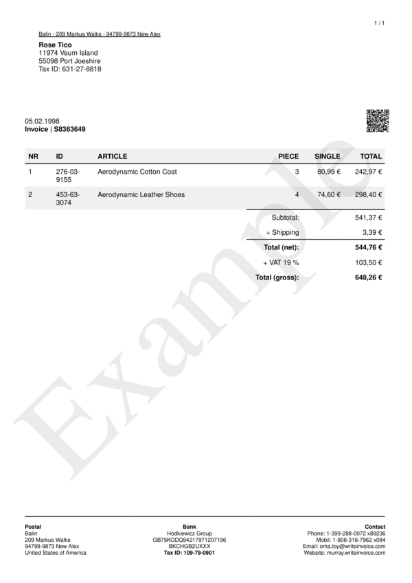
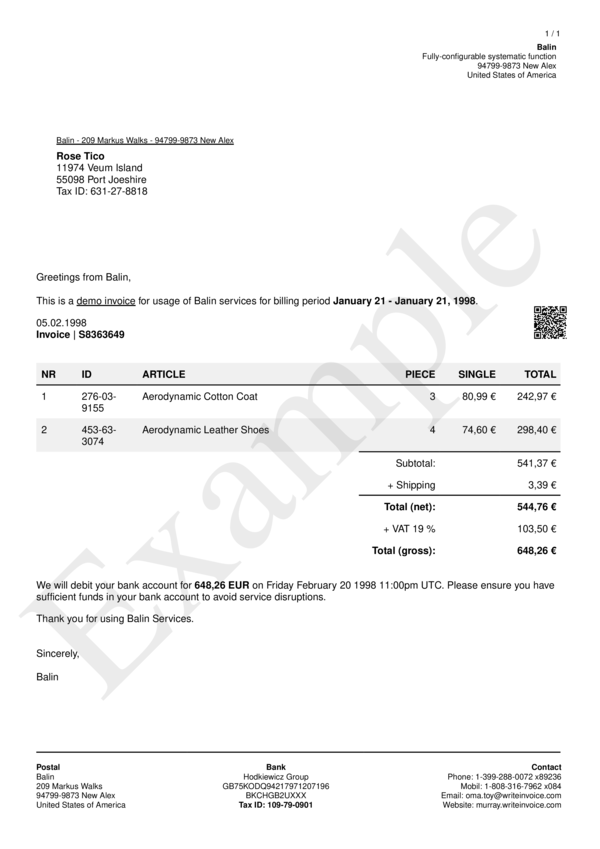

# order

Arrange Sections here. For more Informations see [Sections](../sections/)


## Preview

<div >
    <canvas id='canvas' search=':order' palette='option_detail'></canvas>
</div>
<script src="../assets/js/marker.js"></script>  

 
## Default

### Hash

```ruby
{
 :order => 
  [{:name => :header, :move_down => [0]},
   {:name => :two, :move_down => [:style__sections__pad]},
   {:name => :three, :move_down => [:style__sections__pad]},
   {:name => :four, :move_down => [:style__sections__pad, :style__sections__pad]},
   {:name => :five, :move_down => [:style__sections__pad, :style__sections__pad]},
   {:name => :six, :move_down => [0]},
   {:name => :seven, :move_down => [:style__sections__pad, :style__sections__pad]},
   {:name => :eight, :move_down => [:style__sections__pad]}]
} 
```

### Key

| **Name** | **Category** | **Section** |
| :--- | :--- | :--- |
| ```:order``` |  [Order](./#order) | [All](../sections/) |

### Value


| **Default**| **Validation**| **Type** |
| :--- | :--- | :--- |
| ```[{:name=>:header, :move_down=>[0]}, {:name=>:two, :move_down=>[:style__sections__pad]}, {:name=>:three, :move_down=>[:style__sections__pad]}, {:name=>:four, :move_down=>[:style__sections__pad, :style__sections__pad]}, {:name=>:five, :move_down=>[:style__sections__pad, :style__sections__pad]}, {:name=>:six, :move_down=>[0]}, {:name=>:seven, :move_down=>[:style__sections__pad, :style__sections__pad]}, {:name=>:eight, :move_down=>[:style__sections__pad]}]``` | ```^[a-zA-Z0-9]*$``` | Array |

## Example A.

Remove following sections: `header`, `four`, `seven` and `eight`.

### Output




### Parameters

| | **Value** | **Type** |
|------:|:------|:------|
| **Output** | 'my-invoice.pdf' | String |
| **Payload** | {...} [see Payload](../payload) | hash |
| **Options** | ```{:order =>   [{:name => :two, :move_down => [:style__sections__pad]},   {:name => :three, :move_down => [:style__sections__pad]},   {:name => :five, :move_down => [:style__sections__pad, :style__sections__pad]},   {:name => :six, :move_down => [0]},   {:name => :nine, :move_down => [:style__sections__pad]}]}``` | hash |


### Source Code

* Invoke Function

```ruby
require 'write_invoice'
 
pyld = WriteInvoice::Example.generate()
opts = {
 :order => 
  [{:name => :two, :move_down => [:style__sections__pad]},
   {:name => :three, :move_down => [:style__sections__pad]},
   {:name => :five, :move_down => [:style__sections__pad, :style__sections__pad]},
   {:name => :six, :move_down => [0]},
   {:name => :nine, :move_down => [:style__sections__pad]}]
}
 
WriteInvoice::Document.generate( output: 'my-invoice.pdf', payload: pyld, options: opts )

```

## Example B.

Swap section `three` with `four`.

### Output




### Parameters

| | **Value** | **Type** |
|------:|:------|:------|
| **Output** | 'my-invoice.pdf' | String |
| **Payload** | {...} [see Payload](../payload) | hash |
| **Options** | ```{:order =>   [{:name => :header, :move_down => [0]},   {:name => :two, :move_down => [:style__sections__pad]},   {:name => :four, :move_down => [:style__sections__pad, :style__sections__pad]},   {:name => :three, :move_down => [:style__sections__pad]},   {:name => :five, :move_down => [:style__sections__pad, :style__sections__pad]},   {:name => :six, :move_down => [0]},   {:name => :seven, :move_down => [:style__sections__pad, :style__sections__pad]},   {:name => :eight, :move_down => [:style__sections__pad]},   {:name => :nine, :move_down => [:style__sections__pad]}]}``` | hash |


### Source Code

* Invoke Function

```ruby
require 'write_invoice'
 
pyld = WriteInvoice::Example.generate()
opts = {
 :order => 
  [{:name => :header, :move_down => [0]},
   {:name => :two, :move_down => [:style__sections__pad]},
   {:name => :four, :move_down => [:style__sections__pad, :style__sections__pad]},
   {:name => :three, :move_down => [:style__sections__pad]},
   {:name => :five, :move_down => [:style__sections__pad, :style__sections__pad]},
   {:name => :six, :move_down => [0]},
   {:name => :seven, :move_down => [:style__sections__pad, :style__sections__pad]},
   {:name => :eight, :move_down => [:style__sections__pad]},
   {:name => :nine, :move_down => [:style__sections__pad]}]
}
 
WriteInvoice::Document.generate( output: 'my-invoice.pdf', payload: pyld, options: opts )

```

