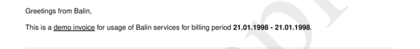
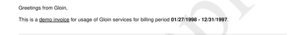

# sections__four__snippet

Define text for section "four".


## Preview

<div >
    <canvas id='canvas' search=':sections__four__snippet' palette='option_detail'></canvas>
</div>
<script src="../assets/js/marker.js"></script>  

 
## Default

### Hash

```ruby
{
 :sections__four__snippet => 
  {:content => nil,
   :struct => 
    "Greetings from <<--a-->>,\n" +
    "\n" +
    "This is a <u>demo invoice</u> for usage of <<--a-->> services for billing period <b><<--b-->> - <<--c-->></b>.",
   :assigns => 
    [{:value => :payload__from__address__name, :format => nil},
     {:value => :payload__date__period__from,
      :format => :obj__format_types__date__short},
     {:value => :payload__date__period__to,
      :format => :obj__format_types__date__default}]}
} 
```

### Key

| **Name** | **Category** | **Section** |
| :--- | :--- | :--- |
| ```:sections__four__snippet``` |  [Sections](./#sections) | [Four](/sections/four) |

### Value


| **Default**| **Validation**| **Type** |
| :--- | :--- | :--- |
| ```{:content=>nil, :struct=>"Greetings from <<--a-->>,\n\nThis is a <u>demo invoice</u> for usage of <<--a-->> services for billing period <b><<--b-->> - <<--c-->></b>.", :assigns=>[{:value=>:payload__from__address__name, :format=>nil}, {:value=>:payload__date__period__from, :format=>:obj__format_types__date__short}, {:value=>:payload__date__period__to, :format=>:obj__format_types__date__default}]}``` | ```^{a-zA-Z0-9}*$``` | Hash |

## Example A.

Change Date format type to `"EU"`.

### Output




### Parameters

| | **Value** | **Type** |
|------:|:------|:------|
| **Output** | 'my-invoice.pdf' | String |
| **Payload** | {...} [see Payload](../payload) | hash |
| **Options** | ```{:sections__four__snippet =>   {:content => nil,   :struct =>     "Greetings from <<--a-->>,\n" +    "\n" +    "This is a <u>demo invoice</u> for usage of <<--a-->> services for billing period <b><<--b-->> - <<--c-->></b>.",   :assigns =>     [{:value => :payload__from__address__name, :format => nil},     {:value => :payload__date__period__from,      :format => :obj__format_types__date__eu},     {:value => :payload__date__period__to,      :format => :obj__format_types__date__eu}]}}``` | hash |


### Source Code

* Invoke Function

```ruby
require 'write_invoice'
 
pyld = WriteInvoice::Example.generate()
opts = {
 :sections__four__snippet => 
  {:content => nil,
   :struct => 
    "Greetings from <<--a-->>,\n" +
    "\n" +
    "This is a <u>demo invoice</u> for usage of <<--a-->> services for billing period <b><<--b-->> - <<--c-->></b>.",
   :assigns => 
    [{:value => :payload__from__address__name, :format => nil},
     {:value => :payload__date__period__from,
      :format => :obj__format_types__date__eu},
     {:value => :payload__date__period__to,
      :format => :obj__format_types__date__eu}]}
}
 
WriteInvoice::Document.generate( output: 'my-invoice.pdf', payload: pyld, options: opts )

```

## Example B.

Change Date format type to `"US"`.

### Output




### Parameters

| | **Value** | **Type** |
|------:|:------|:------|
| **Output** | 'my-invoice.pdf' | String |
| **Payload** | {...} [see Payload](../payload) | hash |
| **Options** | ```{:format_types__date__default => {:strf => "%m/%d/%Y"}, :sections__four__snippet =>   {:content => nil,   :struct =>     "Greetings from <<--a-->>,\n" +    "\n" +    "This is a <u>demo invoice</u> for usage of <<--a-->> services for billing period <b><<--b-->> - <<--c-->></b>.",   :assigns =>     [{:value => :payload__from__address__name, :format => nil},     {:value => :payload__date__period__from,      :format => :obj__format_types__date__default},     {:value => :payload__date__period__to,      :format => :obj__format_types__date__default}]}}``` | hash |


### Source Code

* Invoke Function

```ruby
require 'write_invoice'
 
pyld = WriteInvoice::Example.generate()
opts = {
 :format_types__date__default => {:strf => "%m/%d/%Y"},
 :sections__four__snippet => 
  {:content => nil,
   :struct => 
    "Greetings from <<--a-->>,\n" +
    "\n" +
    "This is a <u>demo invoice</u> for usage of <<--a-->> services for billing period <b><<--b-->> - <<--c-->></b>.",
   :assigns => 
    [{:value => :payload__from__address__name, :format => nil},
     {:value => :payload__date__period__from,
      :format => :obj__format_types__date__default},
     {:value => :payload__date__period__to,
      :format => :obj__format_types__date__default}]}
}
 
WriteInvoice::Document.generate( output: 'my-invoice.pdf', payload: pyld, options: opts )

```

