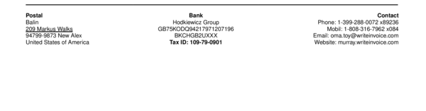
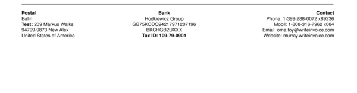

# sections__nine__left_two

Set the `second row` of the left footer column.


## Preview

<div >
    <canvas id='canvas' search=':sections__nine__left_two' palette='option_detail'></canvas>
</div>
<script src="../assets/js/marker.js"></script>  

 
## Default

### Hash

```ruby
{
 :sections__nine__left_two => 
  {:content => nil,
   :struct => "<<--a-->>",
   :assigns => [{:value => :payload__from__address__street, :format => nil}]}
} 
```

### Key

| **Name** | **Category** | **Section** |
| :--- | :--- | :--- |
| ```:sections__nine__left_two``` |  [Sections](./#sections) | [Footer](/sections/footer) |

### Value


| **Default**| **Validation**| **Type** |
| :--- | :--- | :--- |
| ```{:content=>nil, :struct=>"<<--a-->>", :assigns=>[{:value=>:payload__from__address__street, :format=>nil}]}``` | ```^{a-zA-Z0-9}*$``` | Hash |

## Example A.

Underline `<u>` text.

### Output




### Parameters

| | **Value** | **Type** |
|------:|:------|:------|
| **Output** | 'my-invoice.pdf' | String |
| **Payload** | {...} [see Payload](../payload) | hash |
| **Options** | ```{:sections__nine__left_two =>   {:content => nil,   :struct => "<u><<--a-->></u>",   :assigns => [{:value => :payload__from__address__street, :format => nil}]}}``` | hash |


### Source Code

* Invoke Function

```ruby
require 'write_invoice'
 
pyld = WriteInvoice::Example.generate()
opts = {
 :sections__nine__left_two => 
  {:content => nil,
   :struct => "<u><<--a-->></u>",
   :assigns => [{:value => :payload__from__address__street, :format => nil}]}
}
 
WriteInvoice::Document.generate( output: 'my-invoice.pdf', payload: pyld, options: opts )

```

## Example B.

Insert text: `Test:`.

### Output




### Parameters

| | **Value** | **Type** |
|------:|:------|:------|
| **Output** | 'my-invoice.pdf' | String |
| **Payload** | {...} [see Payload](../payload) | hash |
| **Options** | ```{:sections__nine__left_two =>   {:content => nil,   :struct => "<b>Test:</b> <<--a-->>",   :assigns => [{:value => :payload__from__address__street, :format => nil}]}}``` | hash |


### Source Code

* Invoke Function

```ruby
require 'write_invoice'
 
pyld = WriteInvoice::Example.generate()
opts = {
 :sections__nine__left_two => 
  {:content => nil,
   :struct => "<b>Test:</b> <<--a-->>",
   :assigns => [{:value => :payload__from__address__street, :format => nil}]}
}
 
WriteInvoice::Document.generate( output: 'my-invoice.pdf', payload: pyld, options: opts )

```

