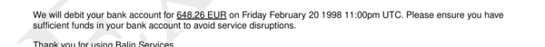
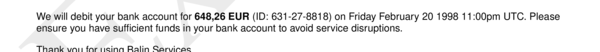

# sections__seven__snippet

Define text for section `seven`.


## Preview

<div >
    <canvas id='canvas' search=':sections__seven__snippet' palette='option_detail'></canvas>
</div>
<script src="../assets/js/marker.js"></script>  

 
## Default

### Hash

```ruby
{
 :sections__seven__snippet => 
  {:content => nil,
   :struct => 
    " We will debit your bank account for <b><<--a-->></b> on <<--b-->>. Please ensure you have sufficient funds in your bank account to avoid service disruptions.",
   :assigns => 
    [{:value => :payload__items__total_gross,
      :format => :obj__format_types__currency__long},
     {:value => :payload__date__billing,
      :format => :obj__format_types__date__long}]}
} 
```

### Key

| **Name** | **Category** | **Section** |
| :--- | :--- | :--- |
| ```:sections__seven__snippet``` |  [Sections](./#sections) | [Seven](/sections/seven) |

### Value


| **Default**| **Validation**| **Type** |
| :--- | :--- | :--- |
| ```{:content=>nil, :struct=>" We will debit your bank account for <b><<--a-->></b> on <<--b-->>. Please ensure you have sufficient funds in your bank account to avoid service disruptions.", :assigns=>[{:value=>:payload__items__total_gross, :format=>:obj__format_types__currency__long}, {:value=>:payload__date__billing, :format=>:obj__format_types__date__long}]}``` | ```^{a-zA-Z0-9}*$``` | Hash |

## Example A.

Underline `<u>` text.

### Output




### Parameters

| | **Value** | **Type** |
|------:|:------|:------|
| **Output** | 'my-invoice.pdf' | String |
| **Payload** | {...} [see Payload](../payload) | hash |
| **Options** | ```{:sections__seven__snippet =>   {:content => nil,   :struct =>     " We will debit your bank account for <u><<--a-->></u> on <<--b-->>. Please ensure you have sufficient funds in your bank account to avoid service disruptions.",   :assigns =>     [{:value => :payload__items__total_gross,      :format => :obj__format_types__currency__long},     {:value => :payload__date__billing,      :format => :obj__format_types__date__long}]}}``` | hash |


### Source Code

* Invoke Function

```ruby
require 'write_invoice'
 
pyld = WriteInvoice::Example.generate()
opts = {
 :sections__seven__snippet => 
  {:content => nil,
   :struct => 
    " We will debit your bank account for <u><<--a-->></u> on <<--b-->>. Please ensure you have sufficient funds in your bank account to avoid service disruptions.",
   :assigns => 
    [{:value => :payload__items__total_gross,
      :format => :obj__format_types__currency__long},
     {:value => :payload__date__billing,
      :format => :obj__format_types__date__long}]}
}
 
WriteInvoice::Document.generate( output: 'my-invoice.pdf', payload: pyld, options: opts )

```

## Example B.

Insert `:payload__to__tax_id, format`.

### Output




### Parameters

| | **Value** | **Type** |
|------:|:------|:------|
| **Output** | 'my-invoice.pdf' | String |
| **Payload** | {...} [see Payload](../payload) | hash |
| **Options** | ```{:sections__seven__snippet =>   {:content => nil,   :struct =>     " We will debit your bank account for <b><<--a-->></b> (ID: <<--c-->>) on <<--b-->>. Please ensure you have sufficient funds in your bank account to avoid service disruptions.",   :assigns =>     [{:value => :payload__items__total_gross,      :format => :obj__format_types__currency__long},     {:value => :payload__date__billing,      :format => :obj__format_types__date__long},     {:value => :payload__to__tax_id, :format => nil}]}}``` | hash |


### Source Code

* Invoke Function

```ruby
require 'write_invoice'
 
pyld = WriteInvoice::Example.generate()
opts = {
 :sections__seven__snippet => 
  {:content => nil,
   :struct => 
    " We will debit your bank account for <b><<--a-->></b> (ID: <<--c-->>) on <<--b-->>. Please ensure you have sufficient funds in your bank account to avoid service disruptions.",
   :assigns => 
    [{:value => :payload__items__total_gross,
      :format => :obj__format_types__currency__long},
     {:value => :payload__date__billing,
      :format => :obj__format_types__date__long},
     {:value => :payload__to__tax_id, :format => nil}]}
}
 
WriteInvoice::Document.generate( output: 'my-invoice.pdf', payload: pyld, options: opts )

```

