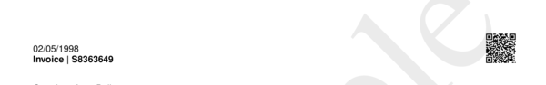

# sections__three__date

Define `date` in section "three"


## Preview

<div >
    <canvas id='canvas' search=':sections__three__date' palette='option_detail'></canvas>
</div>
<script src="../assets/js/marker.js"></script>  

 
## Default

### Hash

```ruby
{
 :sections__three__date => 
  {:content => nil,
   :struct => "<<--a-->>",
   :assigns => 
    [{:value => :payload__date__invoice,
      :format => :obj__format_types__date__eu}]}
} 
```

### Key

| **Name** | **Category** | **Section** |
| :--- | :--- | :--- |
| ```:sections__three__date``` |  [Sections](./#sections) | [Three](/sections/three) |

### Value


| **Default**| **Validation**| **Type** |
| :--- | :--- | :--- |
| ```{:content=>nil, :struct=>"<<--a-->>", :assigns=>[{:value=>:payload__date__invoice, :format=>:obj__format_types__date__eu}]}``` | ```^{a-zA-Z0-9}*$``` | Hash |

## Example A.

Insert text: `Date:`.

### Output


### Parameters

| | **Value** | **Type** |
|------:|:------|:------|
| **Output** | 'my-invoice.pdf' | String |
| **Payload** | {...} [see Payload](../payload) | hash |
| **Options** | ```{:sections__three__date =>   {:content => nil,   :struct => "<b>Date:</b> <<--a-->>",   :assigns =>     [{:value => :payload__date__invoice,      :format => :obj__format_types__date__eu}]}}``` | hash |


### Source Code

* Invoke Function

```ruby
require 'write_invoice'
 
pyld = WriteInvoice::Example.generate()
opts = {
 :sections__three__date => 
  {:content => nil,
   :struct => "<b>Date:</b> <<--a-->>",
   :assigns => 
    [{:value => :payload__date__invoice,
      :format => :obj__format_types__date__eu}]}
}
 
WriteInvoice::Document.generate( output: 'my-invoice.pdf', payload: pyld, options: opts )

```

## Example B.

Change date to `"US" Style`.

### Output




### Parameters

| | **Value** | **Type** |
|------:|:------|:------|
| **Output** | 'my-invoice.pdf' | String |
| **Payload** | {...} [see Payload](../payload) | hash |
| **Options** | ```{:format_types__date__default => {:strf => "%m/%d/%Y"}, :sections__three__date =>   {:content => nil,   :struct => "<<--a-->>",   :assigns =>     [{:value => :payload__date__invoice,      :format => :obj__format_types__date__default}]}}``` | hash |


### Source Code

* Invoke Function

```ruby
require 'write_invoice'
 
pyld = WriteInvoice::Example.generate()
opts = {
 :format_types__date__default => {:strf => "%m/%d/%Y"},
 :sections__three__date => 
  {:content => nil,
   :struct => "<<--a-->>",
   :assigns => 
    [{:value => :payload__date__invoice,
      :format => :obj__format_types__date__default}]}
}
 
WriteInvoice::Document.generate( output: 'my-invoice.pdf', payload: pyld, options: opts )

```

