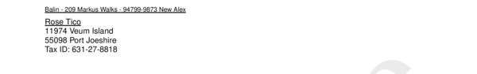

# sections__two__to

Define address label (to) in section "two"


## Preview

<div >
    <canvas id='canvas' search=':sections__two__to' palette='option_detail'></canvas>
</div>
<script src="../assets/js/marker.js"></script>  

 
## Default

### Hash

```ruby
{
 :sections__two__to => 
  {:content => nil,
   :struct => 
    "\t\t<b><<--a-->></b>\n" +
    "<<--b-->>\n" +
    "<<--c-->>\n" +
    "Tax ID: <<--d-->>",
   :assigns => 
    [{:value => :payload__to__address__name, :format => nil},
     {:value => :payload__to__address__street, :format => nil},
     {:value => :payload__to__address__city, :format => nil},
     {:value => :payload__to__tax_id, :format => nil}]}
} 
```

### Key

| **Name** | **Category** | **Section** |
| :--- | :--- | :--- |
| ```:sections__two__to``` |  [Sections](./#sections) | [Two](/sections/two) |

### Value


| **Default**| **Validation**| **Type** |
| :--- | :--- | :--- |
| ```{:content=>nil, :struct=>"\t\t<b><<--a-->></b>\n<<--b-->>\n<<--c-->>\nTax ID: <<--d-->>", :assigns=>[{:value=>:payload__to__address__name, :format=>nil}, {:value=>:payload__to__address__street, :format=>nil}, {:value=>:payload__to__address__city, :format=>nil}, {:value=>:payload__to__tax_id, :format=>nil}]}``` | ```^{a-zA-Z0-9}*$``` | Hash |

## Example A.

Underline `<u>` text.

### Output




### Parameters

| | **Value** | **Type** |
|------:|:------|:------|
| **Output** | 'my-invoice.pdf' | String |
| **Payload** | {...} [see Payload](../payload) | hash |
| **Options** | ```{:sections__two__to =>   {:content => nil,   :struct =>     "\t\t<u><<--a-->></u>\n" +    "<<--b-->>\n" +    "<<--c-->>\n" +    "Tax ID: <<--d-->>",   :assigns =>     [{:value => :payload__to__address__name, :format => nil},     {:value => :payload__to__address__street, :format => nil},     {:value => :payload__to__address__city, :format => nil},     {:value => :payload__to__tax_id, :format => nil}]}}``` | hash |


### Source Code

* Invoke Function

```ruby
require 'write_invoice'
 
pyld = WriteInvoice::Example.generate()
opts = {
 :sections__two__to => 
  {:content => nil,
   :struct => 
    "\t\t<u><<--a-->></u>\n" +
    "<<--b-->>\n" +
    "<<--c-->>\n" +
    "Tax ID: <<--d-->>",
   :assigns => 
    [{:value => :payload__to__address__name, :format => nil},
     {:value => :payload__to__address__street, :format => nil},
     {:value => :payload__to__address__city, :format => nil},
     {:value => :payload__to__tax_id, :format => nil}]}
}
 
WriteInvoice::Document.generate( output: 'my-invoice.pdf', payload: pyld, options: opts )

```

## Example B.

Modify text `<u>`.

### Output


### Parameters

| | **Value** | **Type** |
|------:|:------|:------|
| **Output** | 'my-invoice.pdf' | String |
| **Payload** | {...} [see Payload](../payload) | hash |
| **Options** | ```{:sections__two__to =>   {:content => nil,   :struct => "\t\t<u><<--a-->></u>\n" + "<<--b-->>\n" + "<<--c-->>",   :assigns =>     [{:value => :payload__to__address__name, :format => nil},     {:value => :payload__to__address__street, :format => nil},     {:value => :payload__to__address__city, :format => nil}]}}``` | hash |


### Source Code

* Invoke Function

```ruby
require 'write_invoice'
 
pyld = WriteInvoice::Example.generate()
opts = {
 :sections__two__to => 
  {:content => nil,
   :struct => "\t\t<u><<--a-->></u>\n" + "<<--b-->>\n" + "<<--c-->>",
   :assigns => 
    [{:value => :payload__to__address__name, :format => nil},
     {:value => :payload__to__address__street, :format => nil},
     {:value => :payload__to__address__city, :format => nil}]}
}
 
WriteInvoice::Document.generate( output: 'my-invoice.pdf', payload: pyld, options: opts )

```

