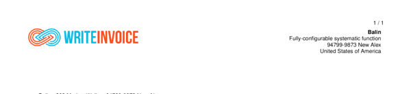

# show__logo

Show or Hide Logo. To set your Image path or base64 string visit [headline__image__src](../options/headline__image__src.html)


## Preview

<div >
    <canvas id='canvas' search=':show__logo' palette='option_detail'></canvas>
</div>
<script src="../assets/js/marker.js"></script>  

 
## Default

### Hash

```ruby
{
 :show__logo => false
} 
```

### Key

| **Name** | **Category** | **Section** |
| :--- | :--- | :--- |
| ```:show__logo``` |  [Show](./#show) | [Header](/sections/header) |

### Value

Allow true or false as value.

| **Default**| **Validation**| **Type** |
| :--- | :--- | :--- |
| ```false``` | ```^(?:true|false)``` | Boolean |

## Example A.

Show Logo

### Output




### Parameters

| | **Value** | **Type** |
|------:|:------|:------|
| **Output** | 'my-invoice.pdf' | String |
| **Payload** | {...} [see Payload](../payload) | hash |
| **Options** | ```{:show__logo => true, :headline__image__src => "<<--ROOT-->__generate/files/templates/logo.png"}``` | hash |


### Source Code

* Invoke Function

```ruby
require 'write_invoice'
 
pyld = WriteInvoice::Example.generate()
opts = {
 :show__logo => true,
 :headline__image__src => "<<--ROOT-->__generate/files/templates/logo.png"
}
 
WriteInvoice::Document.generate( output: 'my-invoice.pdf', payload: pyld, options: opts )

```

