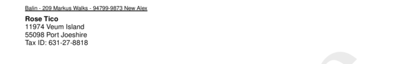

# style__address_label__offset_x

Set `x offset` for address label to adjust position for envelopes with window.


## Preview

<div >
    <canvas id='canvas' search=':style__address_label__offset_x' palette='option_detail'></canvas>
</div>
<script src="../assets/js/marker.js"></script>  

 
## Default

### Hash

```ruby
{
 :style__address_label__offset_x => 20
} 
```

### Key

| **Name** | **Category** | **Section** |
| :--- | :--- | :--- |
| ```:style__address_label__offset_x``` |  [Style](./#style) | [Two](/sections/two) |

### Value

Allow positive integers beginning from 1 as value.

| **Default**| **Validation**| **Type** |
| :--- | :--- | :--- |
| ```20``` | ```^[1-9]d*$``` | Integer |

## Example A.

Set offset to `100`.

### Output


### Parameters

| | **Value** | **Type** |
|------:|:------|:------|
| **Output** | 'my-invoice.pdf' | String |
| **Payload** | {...} [see Payload](../payload) | hash |
| **Options** | ```{:style__address_label__offset_x => 100}``` | hash |


### Source Code

* Invoke Function

```ruby
require 'write_invoice'
 
pyld = WriteInvoice::Example.generate()
opts = {
 :style__address_label__offset_x => 100
}
 
WriteInvoice::Document.generate( output: 'my-invoice.pdf', payload: pyld, options: opts )

```

## Example B.

Set offset to `0`.

### Output




### Parameters

| | **Value** | **Type** |
|------:|:------|:------|
| **Output** | 'my-invoice.pdf' | String |
| **Payload** | {...} [see Payload](../payload) | hash |
| **Options** | ```{:style__address_label__offset_x => 0}``` | hash |


### Source Code

* Invoke Function

```ruby
require 'write_invoice'
 
pyld = WriteInvoice::Example.generate()
opts = {
 :style__address_label__offset_x => 0
}
 
WriteInvoice::Document.generate( output: 'my-invoice.pdf', payload: pyld, options: opts )

```

