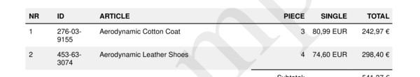

# style__articles__single__format

Set Format Type of Article `"Single"` column.


## Preview

<div >
    <canvas id='canvas' search=':style__articles__single__format' palette='option_detail'></canvas>
</div>
<script src="../assets/js/marker.js"></script>  

 
## Default

### Hash

```ruby
{
 :style__articles__single__format => :format_types__currency__short
} 
```

### Key

| **Name** | **Category** | **Section** |
| :--- | :--- | :--- |
| ```:style__articles__single__format``` |  [Style](./#style) | [Five](/sections/five) |

### Value

Allow only Type Symbol

| **Default**| **Validation**| **Type** |
| :--- | :--- | :--- |
| ```:format_types__currency__short``` | ```:^[a-zA-Z0-9_]*$``` | Symbol |

## Example A.

Set currency format to `long`.

### Output




### Parameters

| | **Value** | **Type** |
|------:|:------|:------|
| **Output** | 'my-invoice.pdf' | String |
| **Payload** | {...} [see Payload](../payload) | hash |
| **Options** | ```{:style__articles__single__format => :format_types__currency__long}``` | hash |


### Source Code

* Invoke Function

```ruby
require 'write_invoice'
 
pyld = WriteInvoice::Example.generate()
opts = {
 :style__articles__single__format => :format_types__currency__long
}
 
WriteInvoice::Document.generate( output: 'my-invoice.pdf', payload: pyld, options: opts )

```

