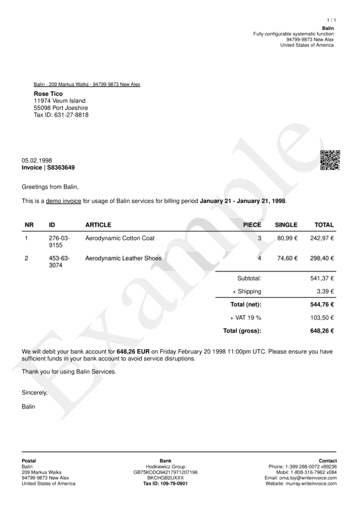
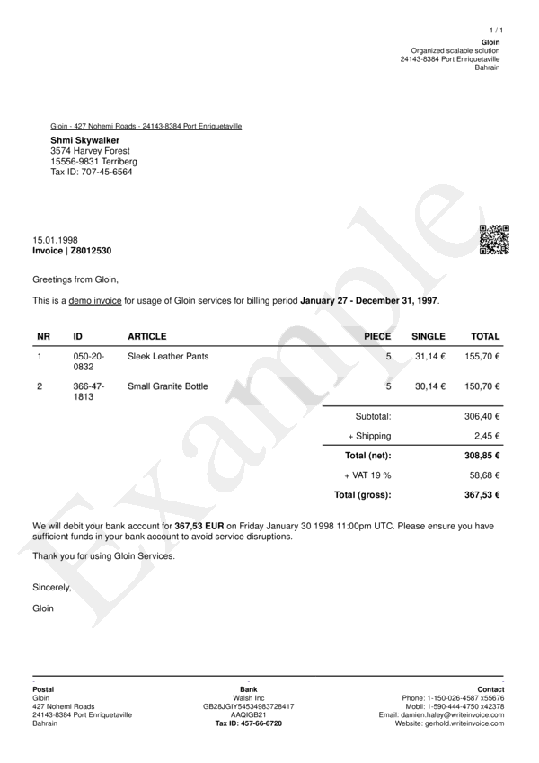

# style__colors__background

Set document background color (not full supported).


## Preview

<div >
    <canvas id='canvas' search=':style__colors__background' palette='option_detail'></canvas>
</div>
<script src="../assets/js/marker.js"></script>  

 
## Default

### Hash

```ruby
{
 :style__colors__background => "FFFFFF"
} 
```

### Key

| **Name** | **Category** | **Section** |
| :--- | :--- | :--- |
| ```:style__colors__background``` |  [Style](./#style) | [All](../sections/) |

### Value

Allow A-Z, a-b and 0-9 as value.

| **Default**| **Validation**| **Type** |
| :--- | :--- | :--- |
| ```"FFFFFF"``` | ```^[a-zA-Z0-9_]*$``` | String |

## Example A.

Set background color to `#E89B54`.

### Output




### Parameters

| | **Value** | **Type** |
|------:|:------|:------|
| **Output** | 'my-invoice.pdf' | String |
| **Payload** | {...} [see Payload](../payload) | hash |
| **Options** | ```{:style__colors__background => "E89B54"}``` | hash |


### Source Code

* Invoke Function

```ruby
require 'write_invoice'
 
pyld = WriteInvoice::Example.generate()
opts = {
 :style__colors__background => "E89B54"
}
 
WriteInvoice::Document.generate( output: 'my-invoice.pdf', payload: pyld, options: opts )

```

## Example B.

Set background color to `#372372`.

### Output




### Parameters

| | **Value** | **Type** |
|------:|:------|:------|
| **Output** | 'my-invoice.pdf' | String |
| **Payload** | {...} [see Payload](../payload) | hash |
| **Options** | ```{:style__colors__background => "372372"}``` | hash |


### Source Code

* Invoke Function

```ruby
require 'write_invoice'
 
pyld = WriteInvoice::Example.generate()
opts = {
 :style__colors__background => "372372"
}
 
WriteInvoice::Document.generate( output: 'my-invoice.pdf', payload: pyld, options: opts )

```

