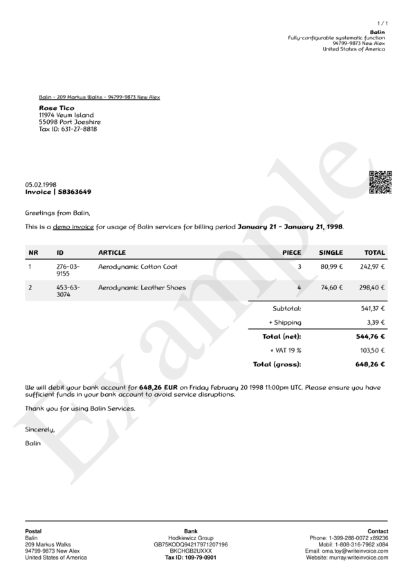

# style__font__name

Set standard `font name`.


## Preview

<div >
    <canvas id='canvas' search=':style__font__name' palette='option_detail'></canvas>
</div>
<script src="../assets/js/marker.js"></script>  

 
## Default

### Hash

```ruby
{
 :style__font__name => "Helvetica"
} 
```

### Key

| **Name** | **Category** | **Section** |
| :--- | :--- | :--- |
| ```:style__font__name``` |  [Style](./#style) | [All](../sections/) |

### Value

Allow A-Z, a-b and 0-9 as value.

| **Default**| **Validation**| **Type** |
| :--- | :--- | :--- |
| ```"Helvetica"``` | ```^[a-zA-Z0-9_]*$``` | String |

## Example A.

Set font name to `RanaCom`.

### Output




### Parameters

| | **Value** | **Type** |
|------:|:------|:------|
| **Output** | 'my-invoice.pdf' | String |
| **Payload** | {...} [see Payload](../payload) | hash |
| **Options** | ```{:style__font__name => "RanaCom", :style__font__family =>   {"RanaCom" =>     {:normal => "~/Library/Fonts/RanaCom-Regular.ttf",     :italic => "~/Library/Fonts/RanaCom-Italic.ttf",     :bold => "~/Library/Fonts/RanaCom-Bold.ttf",     :bold_italic => "~/Library/Fonts/RanaCom-BlackItalic.ttf"}}}``` | hash |


### Source Code

* Invoke Function

```ruby
require 'write_invoice'
 
pyld = WriteInvoice::Example.generate()
opts = {
 :style__font__name => "RanaCom",
 :style__font__family => 
  {"RanaCom" => 
    {:normal => "~/Library/Fonts/RanaCom-Regular.ttf",
     :italic => "~/Library/Fonts/RanaCom-Italic.ttf",
     :bold => "~/Library/Fonts/RanaCom-Bold.ttf",
     :bold_italic => "~/Library/Fonts/RanaCom-BlackItalic.ttf"}}
}
 
WriteInvoice::Document.generate( output: 'my-invoice.pdf', payload: pyld, options: opts )

```

