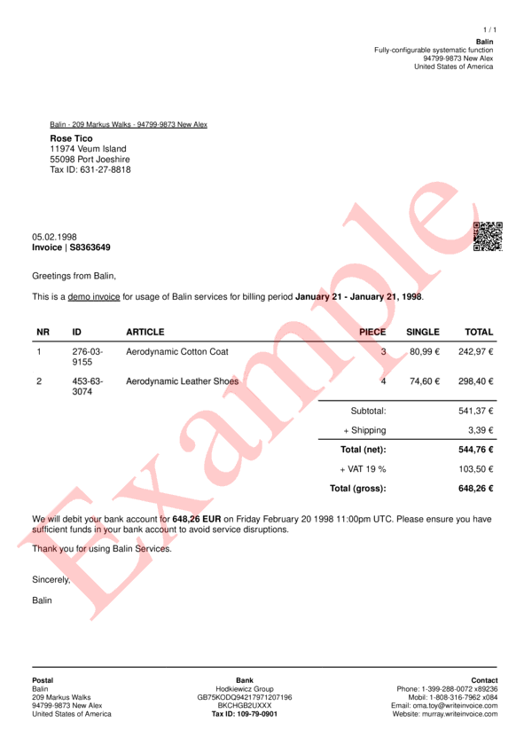

# style__watermark__fill_color

Set `rotation of watermark`.


## Preview

<div >
    <canvas id='canvas' search=':style__watermark__fill_color' palette='option_detail'></canvas>
</div>
<script src="../assets/js/marker.js"></script>  

 
## Default

### Hash

```ruby
{
 :style__watermark__fill_color => "383838"
} 
```

### Key

| **Name** | **Category** | **Section** |
| :--- | :--- | :--- |
| ```:style__watermark__fill_color``` |  [Style](./#style) | [All](../sections/) |

### Value

Allow A-Z, a-b and 0-9 as value.

| **Default**| **Validation**| **Type** |
| :--- | :--- | :--- |
| ```"383838"``` | ```^[a-zA-Z0-9_]*$``` | String |

## Example A.

Change fill color to `Red: #FF0000`

### Output


### Parameters

| | **Value** | **Type** |
|------:|:------|:------|
| **Output** | 'my-invoice.pdf' | String |
| **Payload** | {...} [see Payload](../payload) | hash |
| **Options** | ```{:show__watermark => true, :style__watermark__fill_color => "FF0000"}``` | hash |


### Source Code

* Invoke Function

```ruby
require 'write_invoice'
 
pyld = WriteInvoice::Example.generate()
opts = {
 :show__watermark => true, :style__watermark__fill_color => "FF0000"
}
 
WriteInvoice::Document.generate( output: 'my-invoice.pdf', payload: pyld, options: opts )

```

## Example B.

Change fill color to `Lime: #00FF00` and change transparency to `0.2`

### Output




### Parameters

| | **Value** | **Type** |
|------:|:------|:------|
| **Output** | 'my-invoice.pdf' | String |
| **Payload** | {...} [see Payload](../payload) | hash |
| **Options** | ```{:show__watermark => true, :style__watermark__fill_color => "FF0000", :style__watermark__transparency => 0.2}``` | hash |


### Source Code

* Invoke Function

```ruby
require 'write_invoice'
 
pyld = WriteInvoice::Example.generate()
opts = {
 :show__watermark => true,
 :style__watermark__fill_color => "FF0000",
 :style__watermark__transparency => 0.2
}
 
WriteInvoice::Document.generate( output: 'my-invoice.pdf', payload: pyld, options: opts )

```

