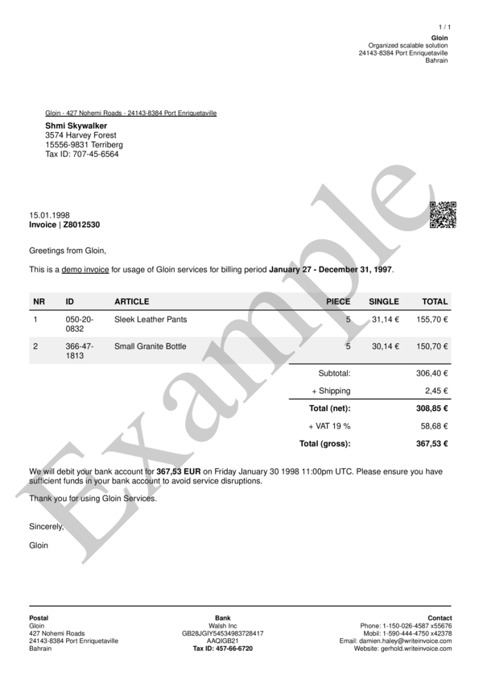
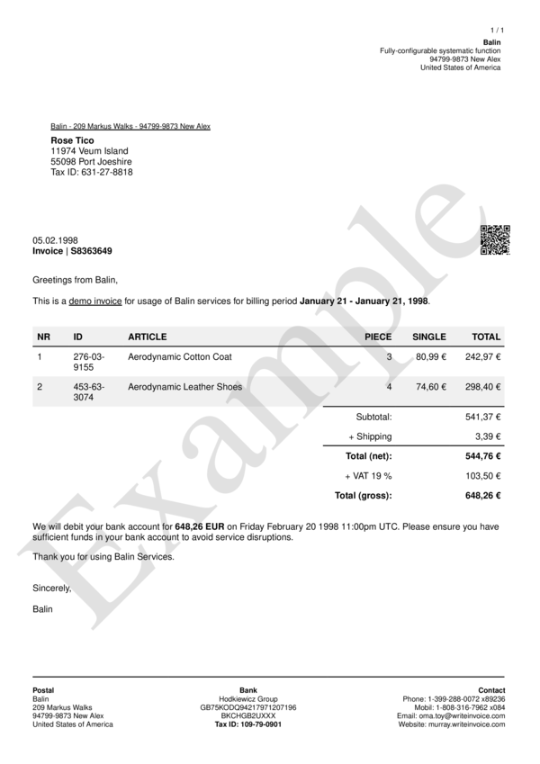

# style__watermark__transparency

Set watermark `transparency`.


## Preview

<div >
    <canvas id='canvas' search=':style__watermark__transparency' palette='option_detail'></canvas>
</div>
<script src="../assets/js/marker.js"></script>  

 
## Default

### Hash

```ruby
{
 :style__watermark__transparency => 0.1
} 
```

### Key

| **Name** | **Category** | **Section** |
| :--- | :--- | :--- |
| ```:style__watermark__transparency``` |  [Style](./#style) | [All](../sections/) |

### Value

Allow float numbers from 0.0 to 9.99.. as value.

| **Default**| **Validation**| **Type** |
| :--- | :--- | :--- |
| ```0.1``` | ```^[1-9](.[0-9]+)?$``` | Float |

## Example A.

Change transparency to `0.5`

### Output




### Parameters

| | **Value** | **Type** |
|------:|:------|:------|
| **Output** | 'my-invoice.pdf' | String |
| **Payload** | {...} [see Payload](../payload) | hash |
| **Options** | ```{:style__watermark__transparency => 0.25}``` | hash |


### Source Code

* Invoke Function

```ruby
require 'write_invoice'
 
pyld = WriteInvoice::Example.generate()
opts = {
 :style__watermark__transparency => 0.25
}
 
WriteInvoice::Document.generate( output: 'my-invoice.pdf', payload: pyld, options: opts )

```

## Example B.

Change transparency to `0.2`

### Output




### Parameters

| | **Value** | **Type** |
|------:|:------|:------|
| **Output** | 'my-invoice.pdf' | String |
| **Payload** | {...} [see Payload](../payload) | hash |
| **Options** | ```{:style__watermark__transparency => 0.15}``` | hash |


### Source Code

* Invoke Function

```ruby
require 'write_invoice'
 
pyld = WriteInvoice::Example.generate()
opts = {
 :style__watermark__transparency => 0.15
}
 
WriteInvoice::Document.generate( output: 'my-invoice.pdf', payload: pyld, options: opts )

```

