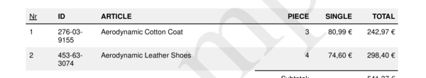

# text__articles__nr

Set Headline Column `"Nr"` of Article Section in your preferred Language. Optional you can use Inline Formating.


## Preview

<div >
    <canvas id='canvas' search=':text__articles__nr' palette='option_detail'></canvas>
</div>
<script src="../assets/js/marker.js"></script>  

 
## Default

### Hash

```ruby
{
 :text__articles__nr => "<b>NR</b>"
} 
```

### Key

| **Name** | **Category** | **Section** |
| :--- | :--- | :--- |
| ```:text__articles__nr``` |  [Text](./#text) | [Five](/sections/five) |

### Value

Allow A-Z, a-b and 0-9 as value.

| **Default**| **Validation**| **Type** |
| :--- | :--- | :--- |
| ```"<b>NR</b>"``` | ```^[a-zA-Z0-9_]*$``` | String |

## Example A.

Bold `<b>` inline formatting.

### Output


### Parameters

| | **Value** | **Type** |
|------:|:------|:------|
| **Output** | 'my-invoice.pdf' | String |
| **Payload** | {...} [see Payload](../payload) | hash |
| **Options** | ```{:text__articles__nr => "<b>Nr</b>"}``` | hash |


### Source Code

* Invoke Function

```ruby
require 'write_invoice'
 
pyld = WriteInvoice::Example.generate()
opts = {
 :text__articles__nr => "<b>Nr</b>"
}
 
WriteInvoice::Document.generate( output: 'my-invoice.pdf', payload: pyld, options: opts )

```

## Example B.

Underline `<u>` inline formatting.

### Output




### Parameters

| | **Value** | **Type** |
|------:|:------|:------|
| **Output** | 'my-invoice.pdf' | String |
| **Payload** | {...} [see Payload](../payload) | hash |
| **Options** | ```{:text__articles__nr => "<u>Nr</u>"}``` | hash |


### Source Code

* Invoke Function

```ruby
require 'write_invoice'
 
pyld = WriteInvoice::Example.generate()
opts = {
 :text__articles__nr => "<u>Nr</u>"
}
 
WriteInvoice::Document.generate( output: 'my-invoice.pdf', payload: pyld, options: opts )

```

