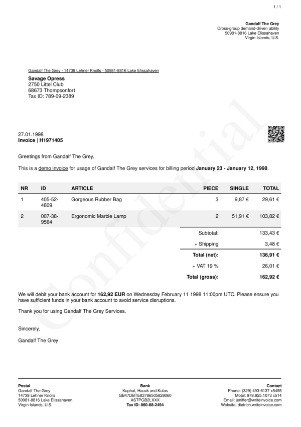

# Change your document watermark


## Overview
Quickest way to change the watermark on your doocument is:
- Install gem with `gem install write_invoice`
- Generate Payload with `WriteInvoice::Example.generate()`
- Set Watermark `text__watermark__:` in options.
- Generate Document with `WriteInvoice::Document.generate()`

*To Hide your Watermark set `show__watermark: false` visit: [show__watermark](../options/show__watermark.html)*




## Steps

### 1: Install Gem

```bash
gem install write_invoice
```

### 2: Generate Payload

```ruby
require 'write_invoice'

pyld = WriteInvoie::Example.generate()
```

### 3: Set Watermark options

```ruby
require 'write_invoice'

pyld = WriteInvoie::Example.generate()
opts = {
    text__watermark: "Confidential", 
    style__watermark__font_size: 120
}
```

### 4: Generate Document

*To Storage*

```ruby
require 'write_invoice'

pyld = WriteInvoie::Example.generate()
opts = {
    text__watermark: "Confidential", 
    style__watermark__font_size: 120
}

WriteInvoice::Document.generate( output: 'test.pdf', payload: pyld, options: opts )
```

*To Memory*

```ruby
require 'write_invoice'

pyld = WriteInvoie::Example.generate()
opts = {
    text__watermark: "Confidential", 
    style__watermark__font_size: 120
}

doc = WriteInvoice::Document.generate( payload: pyld, options: opts )
File.open( 'test.pdf', "w" ) { | f | f.write( doc ) }
```