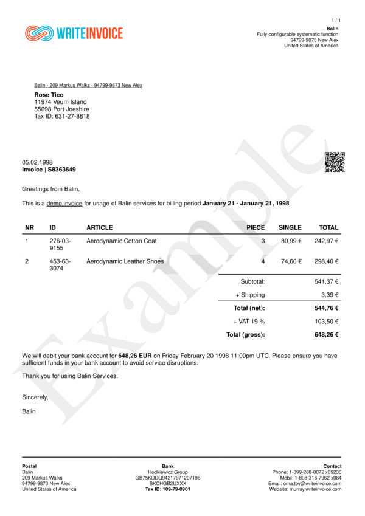

# Quickstart


## Overview
Quickest way to generate an invoice with a custom logo is: 
- Install gem with `gem install write_invoice`
- Generate Payload with `WriteInvoice::Example.generate()`
- Set Logo Path with `headline__image__src:` in options.
- Generate Document with `WriteInvoice::Document.generate()`




## Steps

### 1: Install Gem

```bash
gem install write_invoice
```

### 2: Generate Payload

```ruby
require 'write_invoice'

pyld = WriteInvoie::Example.generate()
```

### 3: Set Logo Path to options

```ruby
require 'write_invoice'

pyld = WriteInvoie::Example.generate()
opts = {
    show__logo: true,
    headline__image__src: 'your path or base64 string'
}
```

### 4: Generate Invoice

*To Storage*

```ruby
require 'write_invoice'

pyld = WriteInvoie::Example.generate()
opts = {
    show__logo: true,
    headline__image__src: 'your path or base64 string'
}

WriteInvoice::Document.generate( output: 'test.pdf', payload: pyld, options: opts )
```

*To Memory*

```ruby
require 'write_invoice'

pyld = WriteInvoie::Example.generate()
opts = {
    show__logo: true,
    headline__image__src: 'your path or base64 string'
}

doc = WriteInvoice::Document.generate( payload: pyld, options: opts )
File.open( 'test.pdf', "w" ) { | f | f.write( doc ) }
```